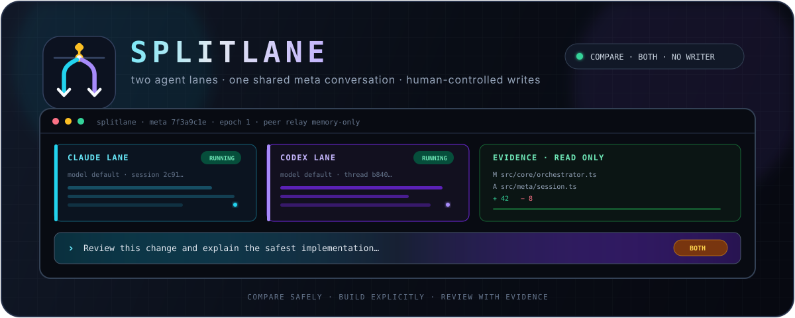

<div align="center">


# Splitlane

**One terminal. Two independent coding-agent lanes. One human-controlled workflow.**

Route the same prompt to Claude Code and Codex, compare their live output, and
control exactly which provider may write.

[](https://github.com/SungJun1217/splitlane/releases/latest)
[](https://github.com/SungJun1217/splitlane/actions/workflows/release.yml)


</div>

<p align="center">
  
</p>

> [!IMPORTANT]
> Splitlane is a local meta-harness for the separately installed official
> `claude` and `codex` CLIs. It does not install providers, store their
> credentials, or call model APIs directly.

```text
                          shared prompt
                               │
                 ┌─────────────┴─────────────┐
                 ▼                           ▼
        ┌─────────────────┐         ┌─────────────────┐
        │   Claude Code   │         │      Codex      │
        │ session · model │         │ thread · model  │
        │ output · tools  │         │ output · tools  │
        └────────┬────────┘         └────────┬────────┘
                 └─────────────┬─────────────┘
                               ▼
                   read-only evidence inspector
                    diff · files · findings
```

## Why Splitlane?

| Capability | Behavior |
|---|---|
| Parallel prompting | Explicit `BROADCAST` sends one immutable request to Claude Code and Codex at nearly the same time. |
| Shared meta conversation | Independent native sessions are grouped into one visible conversation with bounded peer-context relay. |
| Independent lanes | Models, streaming output, tools, status, cancellation, and failures remain provider-local. |
| Explicit write control | The safe default is read-only comparison; build mode grants one visible writer lease. |
| Evidence-first review | Inspect changed files, Git diff, previews, and provider-attributed findings without editing inside the TUI. |
| Recovery | Restore provider session metadata, recover isolated worktrees, and keep queues and authority fail-closed. |

There is no automatic routing, answer grading, winner selection, merge, or
review/fix loop. Recommendations remain visible and overridable; the human stays
in control.

## Quick start

### 1. Install

The standalone preview currently supports macOS on Apple Silicon and
glibc-based Linux on x86_64:

```sh
curl -fsSL https://raw.githubusercontent.com/SungJun1217/splitlane/main/scripts/install.sh | sh
```

The installer verifies the release SHA-256 checksum and writes
`~/.local/bin/splitlane`. Use `SPLITLANE_INSTALL_DIR=/your/bin` to choose another
directory.

### 2. Check your local harnesses

```sh
splitlane doctor /path/to/project
```

Doctor checks that the selected path is the Git repository root, then checks CLI
discovery, versions, coarse authentication status, local schemas, sandbox
contracts, and transport initialization. It starts zero model turns, prints no
raw authentication output, and modifies no provider settings.

For machine-readable diagnostics:

```sh
splitlane doctor /path/to/project --json
```

### 3. Start Splitlane

```sh
splitlane /path/to/project
```

The initial mode is `COMPARE`, the writer is `NONE`, the view shows both lanes,
and the composer sends a direct read-only prompt on the default `CODEX` route.
`Ctrl+R` selects Codex, Claude, or the explicit `BROADCAST` route. Nothing you
type can grant write access until you ask for it.

To implement a change, `Option/Alt+D` switches the composer to `TASK FLOW`, where
`Enter` opens a review of a Codex-only writer grant, `G` grants the lease and
starts the turn, and a completed build opens a separate Claude challenge
confirmation.

On normal and ultra-wide terminals, Claude remains above Codex in the left
workspace and the read-only code/evidence inspector stays on the right. Lane
focus shortcuts never change the prompt route.

> [!NOTE]
> Starting the TUI probes locally installed CLIs but does not start a model
> turn. Sending a prompt does.

## One meta conversation, two real sessions

Claude's native session ID and Codex's native thread ID cannot literally be the
same identifier. Splitlane keeps both provider sessions intact and groups them
under one visible `meta-session/v1` identity.

- A `BROADCAST` request reaches both lanes concurrently.
- A Claude-only or Codex-only turn reaches the inactive provider lazily on that
  provider's next real request—never through a hidden paid synchronization turn.
- Parallel answers cannot see one another while they are being generated. Each
  becomes peer context for the following ordinary turn.
- Relayed provider text is bounded, credential-redacted, and clearly delimited
  as untrusted quoted evidence rather than system or permission authority.
- Shared transcript text stays in memory. Only opaque session metadata and a
  synchronization epoch may be restored; Splitlane never fabricates continuity
  by replaying missing prompts.

The header shows the meta ID, epoch, pending entries, retained bytes, and
redaction count. Each lane shows how much shared context it received.

## Workflow modes

| Mode | Claude Code | Codex | Intended use |
|---|---|---|---|
| `compare` | Read-only | Read-only | Compare answers, plans, and reviews safely. |
| `build` | One writer or inactive | One writer or inactive | Normal implementation with a single visible writer lease. |
| `review` | Writer paused | Reviewer read-only | Review a frozen diff without granting reviewer writes. |
| `isolated` | Own worktree | Own worktree | Parallel implementation in separate worktrees and branches. |

Build mode does not retarget prompts. With send route `BROADCAST`, the selected writer
gets workspace-write access and the peer receives the same request read-only.
Network access and persistent permission rules remain disabled; supported
approvals are allow once, deny, or cancel turn.

## Keyboard map

Every active shortcut is also discoverable in the TUI with `Ctrl+G`.

| Area | Keys |
|---|---|
| Composer | `Enter` run/send · `Option/Alt+D` task flow/direct · `G` grants the lease at a confirmation |
| Prompt routing | Direct mode: `Ctrl+R` cycle `CODEX/CLAUDE/BROADCAST` |
| View | `Option/Alt+0` both/focused · `Alt+1` focus Claude · `Alt+2` focus Codex |
| Output | `PgUp/PgDn` scroll · `Home` oldest · `End` follow tail |
| Workflow | `Ctrl+B` promote writer · `Ctrl+W` revoke · `Ctrl+V` review · `Option/Alt+T` two-lens review |
| Evidence | `Option/Alt+I` inspector · `Tab` focus · `[`/`]` tabs · `↑`/`↓` changed-file preview · `Ctrl+E` recheck working tree · `Ctrl+T` activity · `Ctrl+F` findings |
| Control | `Ctrl+A` approvals (`A` twice to allow once) · `Ctrl+X` cancel focused lane · `Ctrl+K` queue |
| Advanced | `Option/Alt+H` role handoff · `Ctrl+L` isolated worktrees (`C` clean · `K` retain · `D` stop tracking) |
| Settings | `Option/Alt+M` models · `Ctrl+O` roles · `Ctrl+P` capabilities · `Ctrl+U` config |
| Lifecycle | `Ctrl+D` adapter diagnostics · `Ctrl+N` reset focused session · `Ctrl+Q` close and exit |

When a selected lane is busy, Splitlane sends nothing until you explicitly
queue or cancel the whole request. A `BROADCAST` request remains one atomic queue
group; it never silently reaches only one provider.

## Automatic updates

Standalone installations created by `install.sh` default to Claude Code-style
background updates:

1. On TUI startup, check the public GitHub latest release at most once every 24
   hours.
2. Accept only a stable SemVer release and the exact supported platform asset.
3. Bound the download and verify its published SHA-256 and reported
   `--version`.
4. Atomically replace only the managed Splitlane executable.
5. Keep the active TUI running and use the new version on the next launch.

Run an immediate update check with:

```sh
splitlane update
```

Source runs, unmanaged files, symlinks, unsupported platforms, and package
manager paths are never auto-modified. Failures preserve the current executable
and surface an actionable message.

| User setting | Effect |
|---|---|
| `"auto"` | Check and install in the background. This is the default. |
| `"notify"` | Check in the background and report an available update. |
| `"off"` | Disable background update checks. |

Set `SPLITLANE_DISABLE_AUTOUPDATE=1` for an immediate background-check kill
switch. The explicit `splitlane update` command remains available. Project
configuration cannot enable or control executable updates.

## Configuration

Splitlane uses strict, versioned JSON. Project settings override user settings;
per-request model selections override both.

| Scope | Path |
|---|---|
| Project | `.splitlane/config.json` |
| User on macOS | `~/Library/Application Support/Splitlane/config.json` |
| User on Linux | `${XDG_CONFIG_HOME:-~/.config}/splitlane/config.json` |

Example user configuration:

```json
{
  "version": 1,
  "providers": {
    "claude": { "model": "default" },
    "codex": { "model": "default" }
  },
  "queue": { "limit": 10 },
  "ui": {
    "inspector": true,
    "show_tools": "collapsed",
    "restore_sessions": "ask"
  },
  "updates": { "mode": "auto" }
}
```

Project configuration uses the same schema but must omit `updates`. Unknown
keys and invalid values stop startup with an exact configuration path.
Credentials, session IDs, writer leases, and persistent approvals are not valid
configuration keys.

`default` model selection inherits the provider CLI configuration and passes no
model override. Exact provider-specific model IDs are also accepted. Each lane
shows the requested value separately from the provider-confirmed effective
model; a change is refused while that lane is active and applies through a new
provider session afterward.

## Sessions, review, and worktrees

<details>
<summary><strong>Metadata-only session restoration</strong></summary>

Session records live under the platform user-state directory, never in the
tracked repository. Startup can ask to restore, start new, or inspect metadata.
Restore uses provider-native IDs and restores no prompt replay, writer lease,
approval, queue, or workflow mode. `Ctrl+N` resets only the focused lane's
Splitlane metadata.

</details>

<details>
<summary><strong>Single-lens and two-lens review</strong></summary>

Review freezes an exact objective, criteria, Git base, diff, and diff hash, then
revokes the writer lease before starting read-only review. Two-lens review runs
Claude and Codex independently over the same evidence in temporary review
sessions, then restores the original provider sessions. Findings, failures, and
cancellation remain provider-attributed; they are never merged, graded, or
declared an agreement.

</details>

<details>
<summary><strong>Role handoff packets</strong></summary>

`Option/Alt+H` prepares a bounded scout → architect → builder packet with constraints,
files, questions, acceptance criteria, source session, and Git fingerprint.
Confirmation places it in the shared editor but never changes routing or starts
a provider turn.

</details>

<details>
<summary><strong>Isolated worktree lifecycle</strong></summary>

`Ctrl+L` starts with a no-write preview and requires an idle compare state,
empty queues, no approvals, a clean Git root, and an existing base commit.
Confirmation creates one user-state worktree and branch per provider. Splitlane
never runs setup scripts, stashes or resets files, force-removes worktrees,
integrates commits, or deletes branches. Dirty or unintegrated worktrees are
retained for explicit recovery.

A retained run blocks new isolated runs on purpose, and cleanup refuses any run
it cannot prove is safe to remove. When those two rules meet — a dirty worktree,
or one that was never created — `D` in the `Ctrl+L` overlay stops tracking the
run without deleting anything, and names every directory and branch left on
disk.

</details>

## Run from source

Prerequisites are Bun, Node.js 22 or newer, and authenticated official Claude
Code and Codex CLIs.

```sh
git clone git@github.com:SungJun1217/splitlane.git
cd splitlane
bun install
bun run dev /path/to/project
```

## Verify without credentials or model cost

```sh
bun run typecheck
bun test
bun run build
bun run build:compile
```

The offline suite uses captured redacted fixtures and fake provider executables;
it requires no provider credentials, internet access, or paid model turns.

## Design documents

- [Product plan](docs/PRODUCT_PLAN.md)
- [M1 architecture](docs/M1_ARCHITECTURE.md)
- [M1 distribution](docs/M1_DISTRIBUTION.md)
- [M2 single-writer decisions](docs/M2_SINGLE_WRITER_DECISIONS.md)
- [M3 review handoff decisions](docs/M3_REVIEW_HANDOFF_DECISIONS.md)
- [v0.1 completion decisions](docs/V01_COMPLETION_DECISIONS.md)

## Current platform scope

Published binaries are validated for macOS ARM64 and glibc-based Linux x86_64.
Linux ARM64/musl, Intel macOS, and Windows are not yet published.
